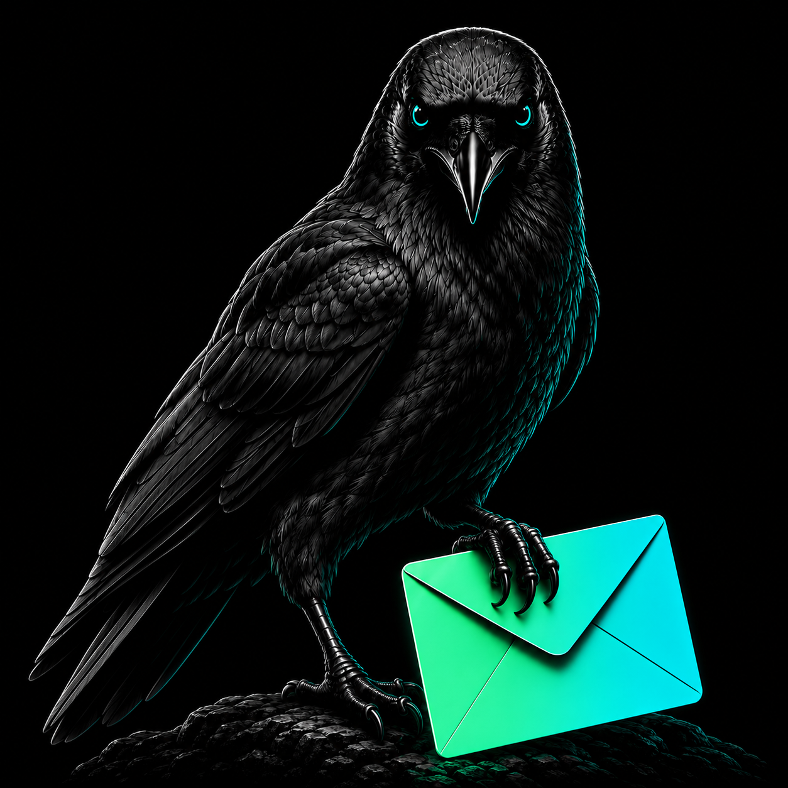
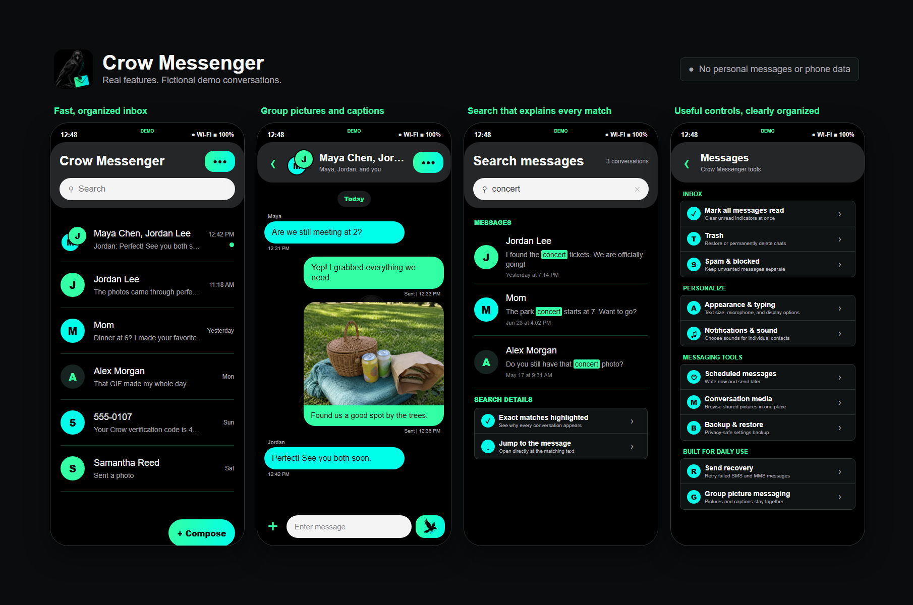
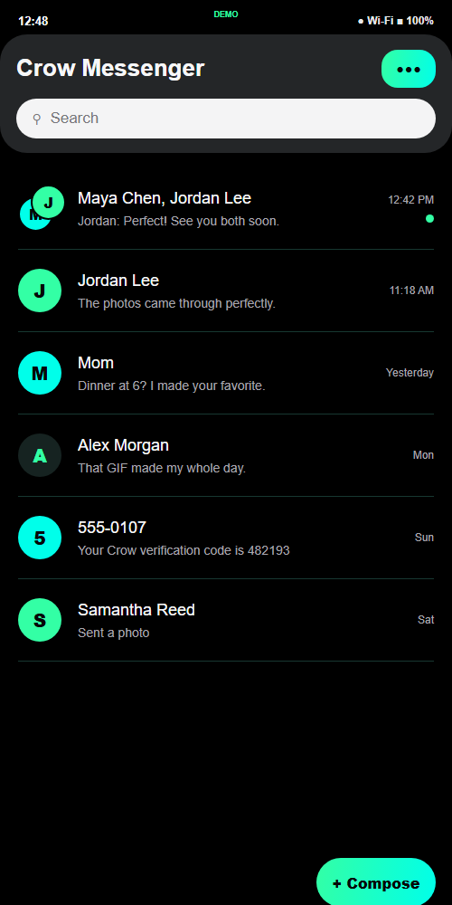
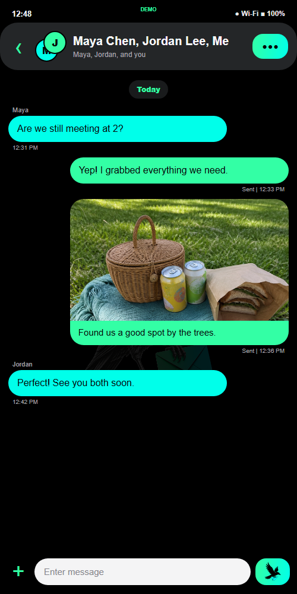
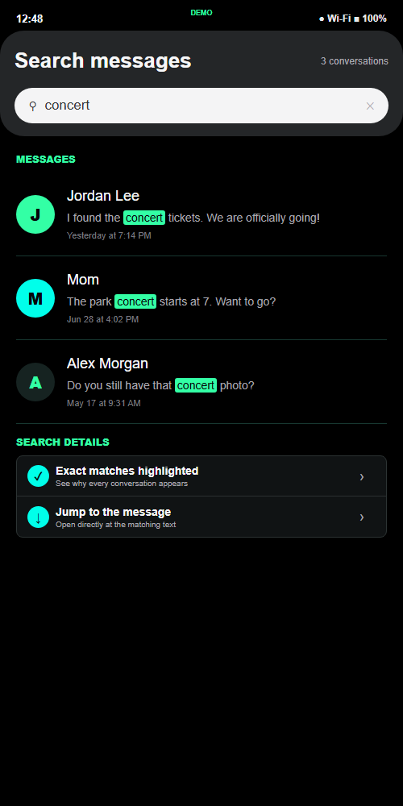
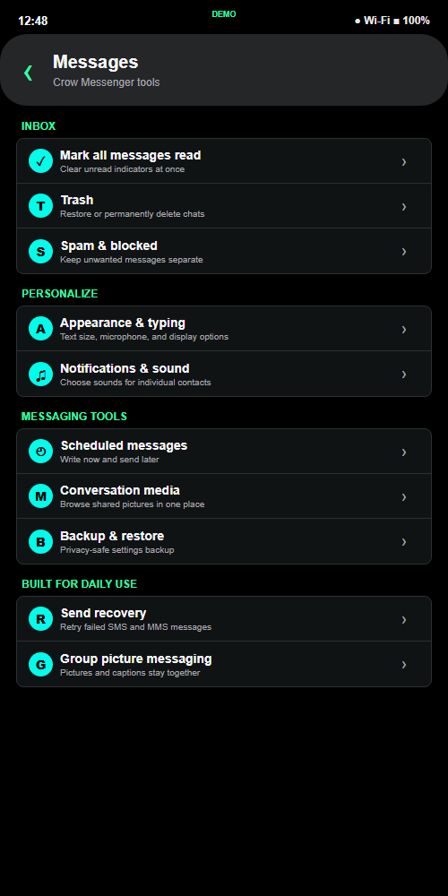

<p align="center">
  
</p>

<h1 align="center">Crow Messenger</h1>

<p align="center">
  <strong>A bold, personal Android SMS and MMS app built for everyday use.</strong><br>
  Fast conversations, dependable picture messaging, contact-aware spam protection, powerful search, and a custom mint-and-cyan identity.
</p>

<p align="center">
  <strong>375 automated tests</strong> &bull; Native Android &bull; SMS + carrier MMS &bull; No ads or analytics
</p>

## App Preview

<p align="center">
  
</p>

<p align="center">
  <em>Real Crow Messenger features shown with entirely fictional contacts, messages, and phone data.</em>
</p>

<table>
  <tr>
    <td align="center"><br><strong>Fast, personal inbox</strong></td>
    <td align="center"><br><strong>Group pictures and captions</strong></td>
    <td align="center"><br><strong>Search with highlighted matches</strong></td>
    <td align="center"><br><strong>Useful tools, clearly organized</strong></td>
  </tr>
</table>

## At a Glance

| | Crow Messenger |
|---|---|
| **Everyday messaging** | One-to-one and group SMS/MMS, pictures, captions, animated GIFs, drafts, scheduled sends, and notifications |
| **Media tools** | Gallery and Camera attachments, direct Android sharing, multi-picture sending, orientation correction, incoming carrier-video playback, and conversation media browsing |
| **Reliability** | Fast inbox updates, accurate unread state, failed-send recovery, interrupted-download recovery, and duplicate group-thread prevention |
| **Control** | Search with highlighted matches, pinned chats, Trash and restore, Spam & Blocked, per-contact sounds, and long-press message actions |
| **Privacy** | On-device message data, no ads, no analytics, no account system, and privacy-safe diagnostics and settings backups |

## About the App

Crow Messenger is an independently designed native Android messaging app created as a modern, personal alternative to Samsung Messages. What began as a custom texting experience for a Galaxy S24+ has grown into a capable daily-use app with one-to-one and group messaging, picture and GIF sharing, notifications, contact-aware spam filtering, powerful search, and a carefully polished interface.

The app is designed around real-world use: conversations should open quickly, new messages should appear promptly, pictures and captions should arrive together, and useful controls should remain easy to find.

## Why Crow Messenger

Crow Messenger is not a reskinned sample project. It is developed against real daily messaging behavior on a Galaxy S24+, including the awkward parts of Android messaging that polished apps have to handle: multipart SMS callbacks, carrier MMS files, picture orientation, group-thread identity, stale unread state, notification actions, keyboard insets, contact changes, failed sends, and large message histories.

Its design is personal on purpose, while its engineering priorities are practical: show what happened, preserve working behavior, recover gracefully, and never make the user guess why a conversation or search result appeared.

## Highlights

### Messaging

- Send and receive standard SMS messages
- Send and receive MMS pictures with or without captions
- Receive carrier video MMS with a thumbnail, playback, saving, sharing, and recovery for initially misidentified downloads
- Send animated GIFs from the keyboard directly into the open conversation
- Automatically prepare oversized GIFs for the carrier limit while preserving their animation
- Send and receive group texts and group pictures
- Keep equivalent group conversations together instead of creating duplicate threads
- Open incoming-message notifications directly in the correct conversation
- Retry failed outgoing texts and recover interrupted or initially unreadable MMS downloads
- See clear Sending, Sent, and Failed status beneath outgoing messages
- Reply or mark a conversation read directly from its notification
- Save unfinished drafts and show them in the inbox
- Schedule text messages for later delivery
- Move conversations to Trash, restore them later, or delete them permanently
- Long-press messages to copy, forward, delete, inspect details, save pictures, or retry failed sends
- Copy verification codes with one tap when Crow recognizes a login or security code

### Pictures

- Choose an existing picture from the Gallery
- Take a new picture with the Camera and bring it back into the conversation
- Share a picture directly from Samsung Gallery into Crow Messenger
- Select or share up to 10 pictures with a compact attachment preview strip
- Preserve picture orientation when sending Gallery photos
- View pictures full screen, then share or save them
- Browse the pictures and media from a conversation in one dedicated view

### Daily-Use Experience

- Responsive inbox and conversation loading with cached previews
- Immediate inbox refresh after sending or receiving messages
- Search complete message history, show the newest matching message from each thread, and highlight the matching words
- Open a text search result directly into a filtered, highlighted conversation view
- Center long search previews around the matching text so results always explain themselves
- Pin important conversations
- Mark individual conversations or all messages as read
- Contact photos, group avatars, timestamps, unread badges, and sender labels
- Quick jump to the newest message when reviewing older history
- Keyboard-aware conversation layout that keeps recent messages visible

### Notifications and Privacy

- Incoming message notifications with per-contact sound choices
- Mute individual conversations
- Separate Spam & Blocked inbox
- Custom spam keywords that apply only to unknown senders, protecting normal conversations with saved contacts
- Block, unblock, and manually mark conversations as spam
- Privacy-safe troubleshooting reports that avoid exposing message contents and phone numbers
- Export and restore a privacy-safe settings backup without including conversations or phone numbers
- Validate shared Gallery links and external recipients before they enter the sending flow

### Original Design

- Custom Crow Messenger name, launcher icon, watermark, and empty-state artwork
- Black interface with signature mint (`#33FFA5`) and cyan (`#00FFEA`) accents
- Rounded, friendly headers and message bubbles
- Custom crow send button and gradient action controls
- Samsung Messages-inspired ergonomics with its own distinct visual identity

## Quality

Crow Messenger is backed by **375 automated tests** covering message parsing, conversation grouping, search accuracy, unread-state timing, contact-aware spam behavior, Android sharing intents, SMS/MMS handling, incoming carrier-video recovery, animated GIF preparation, send-result recovery, scheduled messages, notifications, settings backup, and other core behavior. Android lint checks are also part of the verification process.

The project uses save points throughout development so working SMS and MMS behavior can be protected while new features are added.

## Current Scope

Crow Messenger supports SMS and carrier MMS. RCS features such as typing indicators, read receipts, and internet-based high-resolution chats are outside the current scope.

Carrier MMS behavior can vary by device, mobile network, and carrier configuration, so picture and group messaging are tested on the target Galaxy S24+ before a build is treated as ready for daily use.

## Privacy

- Crow Messenger has no advertising SDK, analytics service, account system, or cloud messaging backend.
- Crow stores SMS/MMS records, contacts-derived display data, drafts, blocked senders, and notification preferences only on the Android device; carrier delivery still uses Android's normal SMS/MMS services.
- The optional troubleshooting report omits names, phone numbers, captions, and message text.
- Settings backups intentionally exclude conversations, pictures, phone numbers, drafts, and scheduled-message contents.
- Repository tests use reserved fictional `555` phone numbers and `example.com` addresses rather than real contact data.

## Built With

- Native Android and Java
- Android SMS, MMS, contacts, notifications, Camera, and Gallery integrations
- Gradle build tooling
- Robolectric and JUnit automated tests

## Development

Build a debug version with the Gradle wrapper:

```powershell
./gradlew assembleDebug
```

Run the automated test suite:

```powershell
./gradlew testDebugUnitTest
```

Crow Messenger must be selected as Android's default SMS app to access and manage the device's SMS/MMS conversations.

---

<p align="center">
  Designed, tested, and refined through real daily messaging on a Samsung Galaxy S24+.
</p>
